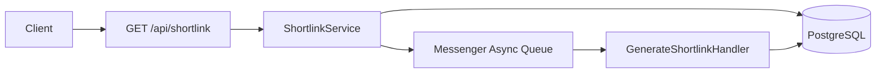

# ShortUrl API (Symfony)

API-сервис генерации и хранения коротких URL-ссылок на базе Symfony, PostgreSQL, RabbitMQ и Docker.

## Что реализовано

- Endpoint `GET /api/shortlink?url={original_url}`:
  - если короткая ссылка уже готова: возвращает `200` и данные shortlink;
  - если shortlink отсутствует или еще не готов: возвращает `202` и сообщение `Ссылка генерируется`, затем постановка задачи в очередь.
- Асинхронная генерация short code через Symfony Messenger + RabbitMQ.
- Уникальность в БД:
  - `original_url` уникален;
  - `short_code` уникален.
- Защита от гонок при конкурентных запросах:
  - атомарный upsert для `original_url` (`INSERT ... ON CONFLICT DO NOTHING`);
  - уникальные индексы как источник истины;
  - повторные попытки назначения short code в worker.
- Short code длиной от 4 до 8 символов, алфавит `[a-zA-Z0-9]`.
- Дополнительно: endpoint редиректа `GET /r/{shortCode}`.

## Технологии

- PHP 8.2+
- Symfony 7
- PostgreSQL 16
- RabbitMQ 3
- Docker + Docker Compose
- Doctrine ORM + Doctrine Migrations
- Symfony Messenger

## Требования к окружению

- Установленный Docker Desktop (Linux containers mode).
- Включенный Docker daemon.
- Bash-совместимая оболочка для запуска `scripts/*.sh` (`Git Bash`, `WSL` или Linux/macOS shell).
- Свободные порты:
  - `8080` (API через Nginx)
  - `5432` (PostgreSQL)
  - `5672` (RabbitMQ AMQP)
  - `15672` (RabbitMQ Management UI)

## Сборка проекта одной командой

Рекомендуемый сценарий запуска — `scripts/run-all.sh`.

Сценарий выполняет полный цикл:

1. Автоопределение команды compose (`docker.exe compose` или `docker compose`).
2. Создание `.env` из `.env.example`, если файла нет.
3. Остановка текущего стека (`docker compose down --remove-orphans`) без удаления volume.
4. Подъем контейнеров (`db`, `rabbitmq`, `app`, `nginx`, `worker`) и сборка `loadtest`.
5. Установка зависимостей Composer (с повторами при сетевой ошибке).
6. Создание БД, миграции, `messenger:setup-transports`.
7. Синхронизация прав на `var/` для корректной записи cache/log внутри `app`.
8. PHPUnit, smoke-check и load-test.

Запуск:

```bash
bash ./scripts/run-all.sh
```

Режимы:

```bash
bash ./scripts/run-all.sh --mode quick
bash ./scripts/run-all.sh --mode full
```

- `quick` — ускоренный прогон для локальной проверки (облегченные параметры load-test).
- `full` — полный прогон с нагрузочным тестом по параметрам по умолчанию из `scripts/load-test.sh`.

Дополнительные флаги:

```bash
bash ./scripts/run-all.sh --skip-load
bash ./scripts/run-all.sh --skip-smoke
bash ./scripts/run-all.sh --skip-unit
bash ./scripts/run-all.sh --smoke-wait 5
bash ./scripts/run-all.sh --help
```

`run-all.sh` выполняет smoke/load через нормализацию `CRLF -> LF` внутри `loadtest` контейнера, что исключает падения bash-скриптов на Windows checkout.
Параметр `--smoke-wait` задает максимальное время ожидания готового shortlink в smoke-check (по умолчанию `10` секунд).

## Быстрый запуск

1. Скопировать переменные окружения:

```bash
cp .env.example .env
```

2. Собрать и поднять инфраструктуру:

```bash
docker compose up -d --build db rabbitmq app nginx
```

3. Установить PHP-зависимости:

```bash
docker compose run --rm app composer install --no-interaction
```

4. Создать БД и применить миграции:

```bash
docker compose exec app php bin/console doctrine:database:create --if-not-exists
docker compose exec app php bin/console doctrine:migrations:migrate --no-interaction
```

5. Подготовить transport для очереди:

```bash
docker compose exec app php bin/console messenger:setup-transports
```

6. Запустить worker:

```bash
docker compose up -d worker
```

7. Проверить, что сервис доступен:

```bash
curl "http://localhost:8080/api/shortlink?url=https://example.com"
```

При сетевой ошибке во время `composer install` выполняется повторный запуск той же команды.

## API

### 1) Получить/сократить ссылку

`GET /api/shortlink?url={original_url}`

#### Пример запроса

```bash
curl "http://localhost:8080/api/shortlink?url=https://example.com/some/long/path"
```

#### Ответ: shortlink уже готов (`200`)

```json
{
  "status": "ready",
  "original_url": "https://example.com/some/long/path",
  "short_code": "aZ13",
  "short_url": "http://localhost:8080/r/aZ13"
}
```

#### Ответ: shortlink в процессе генерации (`202`)

```json
{
  "status": "pending",
  "original_url": "https://example.com/some/long/path",
  "message": "Ссылка генерируется"
}
```

#### Ответ: ошибка валидации (`400`)

```json
{
  "status": "error",
  "message": "Параметр `url` должен быть валидным HTTP/HTTPS URL."
}
```

#### Ответ: внутренняя ошибка (`500`)

```json
{
  "status": "error",
  "message": "Внутренняя ошибка сервиса.",
  "debug_error": "..."
}
```

Поле `debug_error` возвращается только в debug-режиме (`APP_DEBUG=1`).

### 2) Редирект по короткой ссылке (дополнительно)

`GET /r/{shortCode}`

Пример:

```bash
curl -I "http://localhost:8080/r/aZ13"
```

Ожидаемый статус: `302 Found`, `Location: <original_url>`.

## Тестирование

Запуск тестов:

```bash
docker compose run --rm app composer test
```

## Smoke-check сценария

Автоматическая проверка (рекомендуется):

```bash
docker compose run --rm loadtest run-smoke-check
```

Скрипт проверяет:

1. Первый запрос возвращает `202` и `status=pending`.
2. Повторный запрос возвращает `200` и `status=ready`.
3. `GET /r/{shortCode}` возвращает `302` с `Location` на исходный URL.
4. Валидацию (`400` без `url` и с невалидным `url`).
5. Идемпотентность (тот же `short_code` при повторном запросе).

Параметры:

```bash
docker compose run --rm loadtest run-smoke-check --base-url "http://nginx" --wait-ready 5
```

`--wait-ready` задает максимальное время ожидания перехода из `pending` в `ready`; проверка выполняется с polling по 1 секунде.

Перед запуском требуется поднятое состояние контейнеров (`docker compose ps`), включая `worker`.

Локальный запуск в bash (при наличии `bash` и `curl` в системе):

```bash
bash ./scripts/smoke-check.sh --base-url "http://127.0.0.1:8080" --wait-ready 5
```

## Load-test сценарий (конкурентность и деградация)

Скрипт `scripts/load-test.sh` проверяет пункт по конкурентным запросам:

1. **Race-тест**: много одновременных запросов к одному `url`, в БД должна остаться ровно одна запись.
2. **Scaling-тест**: фиксированный профиль `50 RPS` на разных объемах таблицы (`shortlinks`) без линейной деградации latency.

Запуск через Docker (рекомендуется, локальные `psql/hey/python3` не нужны):

```bash
docker compose run --rm loadtest run-load-test
```

Первый запуск может занять больше времени, потому что собирается образ `shorturl-loadtest`.

Параметры (пример):

```bash
docker compose run --rm loadtest run-load-test \
  --base-url "http://nginx" \
  --db-host "db" \
  --db-port "5432" \
  --db-name "shorturl" \
  --db-user "shorturl" \
  --db-password "shorturl" \
  --sizes "1000,50000,200000" \
  --duration "20s" \
  --concurrency "50" \
  --qps-per-worker "1"
```

Перед запуском требуется поднятое состояние сервисов `app`, `nginx`, `db`, `rabbitmq`, `worker`:

```bash
docker compose up -d --build db rabbitmq app nginx worker
```

Быстрый прогон (для локальной проверки, короче и легче):

```bash
docker compose run --rm loadtest run-load-test \
  --sizes "100,1000" \
  --duration "5s" \
  --race-requests "200" \
  --max-avg-growth "100" \
  --max-p95-growth "100" \
  --max-rps-drop "1"
```

Формат вывода метрик:

- В каждом прогоне печатается `Response time histogram legend`:
  - `<seconds>` — верхняя граница bucket по latency (секунды);
  - `[count]` — количество ответов в bucket;
  - `|<bar>` — относительная плотность bucket (длиннее = больше ответов).
- В конце scaling-теста печатается `Raw metrics table` с колонками:
  - `size` — размер датасета;
  - `avg_latency_sec` — средняя latency (секунды);
  - `p95_latency_sec` — 95-й перцентиль latency (секунды);
  - `rps` — requests per second.
- Дополнительно печатается `Relative ratios table`:
  - `avg_ratio`, `p95_ratio`, `rps_ratio` — отношение текущего размера к базовому (`первая строка = 1.0000`).

Интерпретация локального запуска:

- Для локального Docker-стенда значения latency в диапазоне нескольких секунд допустимы.
- Ключевой критерий корректности — `Scaling criteria PASSED` и отсутствие неожиданных HTTP-кодов (допустимы `200` и `202`).

Важно: load-test очищает и заполняет таблицу `shortlinks` (используется `TRUNCATE`).

Имена контейнеров формируются Docker Compose автоматически и зависят от имени проекта/папки.

Критерии (по умолчанию в скрипте):

- рост `Average latency` не более `1.30x` от базового размера;
- рост `p95 latency` не более `1.30x`;
- просадка `RPS` не более `20%`.

## Полезные команды

- Проверка логов worker:

```bash
docker compose logs -f worker
```

- Проверка логов приложения:

```bash
docker compose logs -f app nginx
```

- Перезапуск `app` и `worker` после изменений:

```bash
docker compose restart app worker
```

- Остановка окружения:

```bash
docker compose down
```

## Архитектура



## Структура проекта

- `src/Controller/ShortlinkController.php` — HTTP слой.
- `src/Service/ShortlinkService.php` — бизнес-логика (Service Layer).
- `src/Message/GenerateShortlinkMessage.php` — сообщение очереди.
- `src/MessageHandler/GenerateShortlinkHandler.php` — async обработчик.
- `src/Repository/ShortlinkRepository.php` — конкурентно-безопасные операции.
- `src/Entity/Shortlink.php` — модель БД.
- `migrations/Version20260629230000.php` — схема БД.
